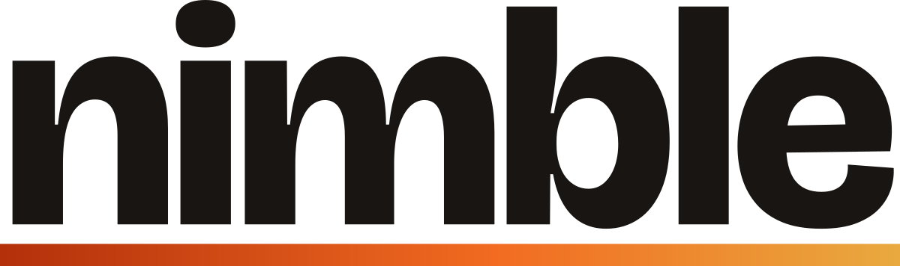

<p align="center">
    <picture>
        <source media="(prefers-color-scheme: dark)" srcset="assets/nimble-wordmark-on-dark.svg">
        <source media="(prefers-color-scheme: light)" srcset="assets/nimble-wordmark-on-light.svg">
        
    </picture>
</p>

&nbsp;

<p align="center">
    An input automation toolkit for Windows and Linux, covering keyboard and mouse hooks, bindings, remapping, and input synthesis.
</p>

<p align="center">
    <a href="https://github.com/braycarlson/nimble/actions/workflows/ci.yml"></a>
    <a href="https://ziglang.org"></a>
    <a href="LICENSE"></a>
</p>

## Overview

A hook sees each event before the rest of the system does, and a handler returns `consume`
or `pass` to decide what happens next. The hook types are generic over their
configuration, so the binding tables are sized at compile time.

## Features

- **Binding kinds**: A binding is a combination, a chord, a typed sequence, a command, a
  macro, a toggle, a oneshot, a repeat, or a timer.
- **Grab or observe**: A Linux runtime either grabs the device or only watches it, and the
  grab can be released and reacquired while running.
- **Rescue**: A two second hold of both shift keys releases the grab, and it is restored
  three seconds later, so a binding cannot lock a session out. The rescue is on by
  default.
- **Middleware**: A pipeline sits in front of the registry, with a blocklist, a remapper,
  and a logger supplied.
- **Synthesis**: The library sends keys, mouse buttons, motion, and text, and on Windows
  it can target a window directly.
- **Declared capabilities**: The clipboard, monitor queries, window filters, and remote
  access are each declared per backend, so using a missing one is a compile error.

## Install

The library ships as a Zig package holding one module, also named `nimble`. Fetch it into
your own project and import the module in your `build.zig`.

```
zig fetch --save git+https://github.com/braycarlson/nimble
```

```zig
const nimble = b.dependency("nimble", .{
    .target = target,
    .optimize = optimize,
});

exe.root_module.addImport("nimble", nimble.module("nimble"));
```

nimble requires Zig 0.16.0.

## Usage

A runtime opens, a hook is constructed from its configuration, bindings are attached, and
the loop runs until a handler stops it. The examples under `examples/` cover mouse
handling, middleware, timers, tiling, and the Windows-only paths.

```zig
const std = @import("std");

const nimble = @import("nimble");

const Keyboard = nimble.KeyboardType(.{ .pass_injected = true });
const Key = nimble.Key;
const Response = nimble.Response;

const App = struct {
    fn on_greet(_: *App, _: *const Key) Response {
        _ = nimble.simulate.text.send("Hello, World!") catch return .pass;

        return .consume;
    }

    fn on_chord(_: *App) Response {
        std.debug.print("chord\n", .{});

        return .consume;
    }

    fn on_exit(_: *App, _: *const Key) Response {
        nimble.loop.stop();

        return .consume;
    }
};

var keyboard: Keyboard = undefined;

pub fn main() !void {
    try nimble.runtime.open(.{ .mode = .grab });
    defer nimble.runtime.close();

    keyboard = Keyboard.init();
    defer keyboard.deinit();

    var app = App{};

    _ = try keyboard.bind("Ctrl+1").on(&app, App.on_greet);
    _ = try keyboard.bind("Alt+Q").on(&app, App.on_exit);
    _ = try keyboard.chord("ABC").on(&app, App.on_chord);

    try keyboard.start();

    nimble.loop.run();
}
```

A chord handler takes only the context, since the trigger is the sequence rather than one
key, while a combination handler also receives the key that fired it.

## Linux

A grabbing hook needs read access to the event devices and write access to `uinput`. The
`nimbled` daemon holds the grab and serves clients over a socket, which is how an
application keeps working without running as root.

| Path | What it carries |
|---|---|
| `contrib/systemd/nimbled.service` | The daemon unit. |
| `contrib/systemd/99-nimble-uinput.rules` | The udev rule for `uinput` access. |
| `contrib/systemd/install.sh` | The installer for both, plus the units for the applications that use them. |

The `drill` binary verifies a host before anything else runs, with `just drill-probe`,
`just drill-scan`, `just drill-synthesis`, `just drill-observe`, and `just drill-grab`.

## Development

The recipes below wrap `zig build`, and a bare `just` lists them all. The tidy law is a
test rather than a separate linter, so the mechanical rules run with everything else.

| Command | What it runs |
|---|---|
| `just ci` | The formatting check, compilation, the unit tests, and the fuzzer smoke run. |
| `just test` | The unit tests and the formatting check. |
| `just mock` | The full pipeline against the mock backend. |
| `just linux` | The Linux backend tests, on a Linux host. |
| `just tidy` | The tidy law on its own. |
| `just check-windows` | The compile of every artifact for Windows from any host. |

## Licence

MIT. See [LICENSE](LICENSE).
